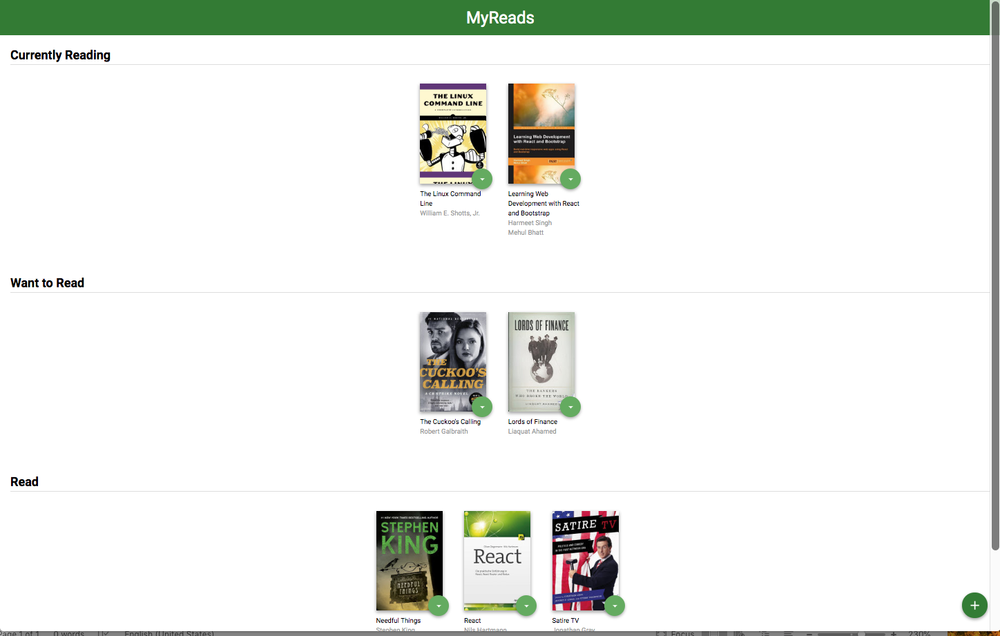
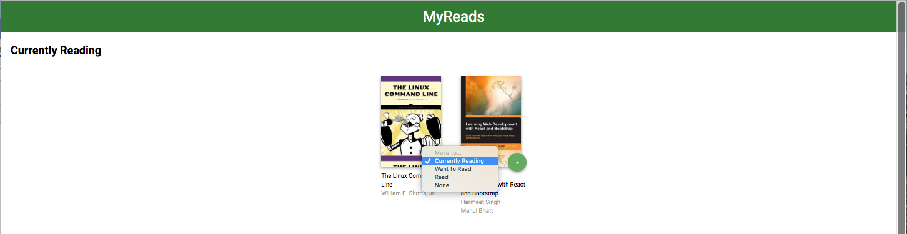
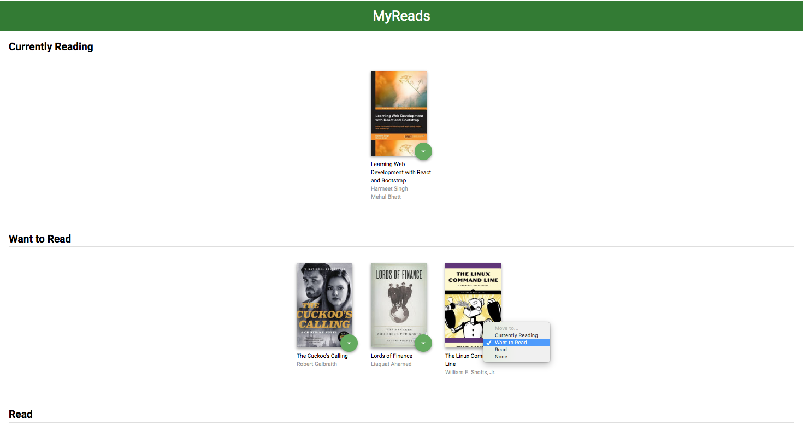
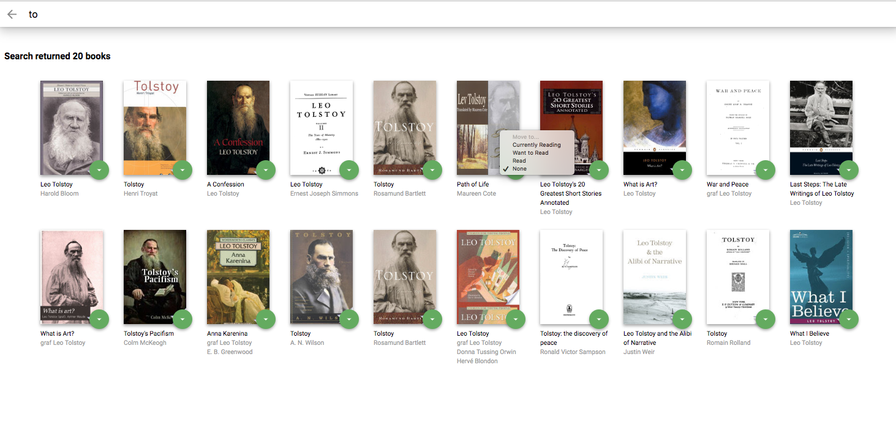

# MyReads Project

This project uses udacty BookAPI to fetch books and the react component of the application is responsible for maintaining the category of Book.  Based on the category of the book,
the book will be placed on that category shelf

To get started right away:

* install all project dependencies with `npm install`
* start the development server with `npm start`

This is the main page where each book is in one category.

Here is an example of moving one book to a different shelf.

Now that book is on Want to Read shelf

From the search page you can add books to different categories.

## Important
The backend API uses a fixed set of cached search results and is limited to a particular set of search terms, which can be found in [SEARCH_TERMS.md](SEARCH_TERMS.md). That list of terms are the _only_ terms that will work with the backend, so don't be surprised if your searches for Basket Weaving or Bubble Wrap don't come back with any results.

## Create React App

This project was bootstrapped with [Create React App](https://github.com/facebookincubator/create-react-app). You can find more information on how to perform common tasks [here](https://github.com/facebookincubator/create-react-app/blob/master/packages/react-scripts/template/README.md).

## Contributing

This repository is the starter code for _all_ Udacity students. Therefore, we most likely will not accept pull requests.

For details, check out [CONTRIBUTING.md](CONTRIBUTING.md).
